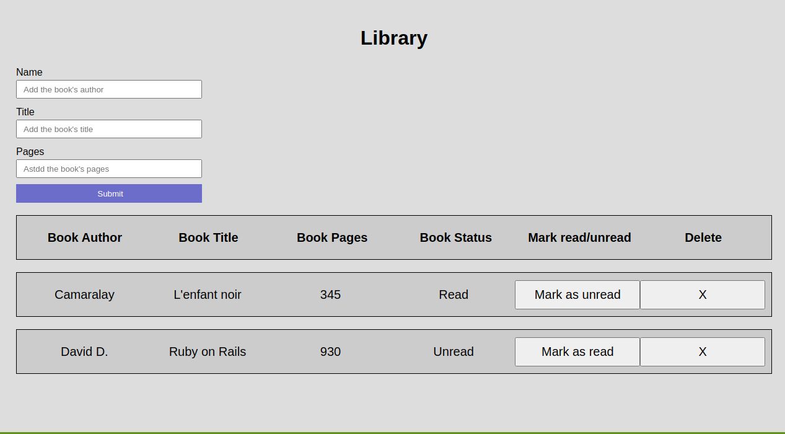

# Library
In this project, we will be building a library.

# Screenshot

## Live Demo

[Click for live webpage](https://theophile-kango.github.io/library)

## Built With

- JavaScript
- HTML5 
- CSS3

## Requirements

- Keep your code clean.
- Do not commit console.log to your repo. - It’s ugly, it kills performance and it can make confidential data be visible in the browser tools.
- Keep the number of changes/updates to the DOM as low as possible, they are very expensive for the browser.
- Keep the application logic separated from DOM manipulation tasks.
- Keep all the styling logic in CSS files.
If you use node modules 
- lock files should be in the repository to avoid problems with future versions of the dependencies.
If you use ES6 
- use object destructuring to get the values from an object. This way you can avoid repeating a lot of code.

### Setup

- Clone the repository on your local machine
- Cd into the folder
- Open index.html file

### Install

- Install VSCode or any code editor you like

## Authors

👤 **Murilo Roque**

- Github: [@muriloroque](https://github.com/MuriloRoque)
- Twitter: [@MuriloRoquePai1](https://twitter.com/MuriloRoquePai1)
- Linkedin: [MuriloRoque](https://www.linkedin.com/in/murilo-roque-b1268741/)

👤 **Theophile Kango**

- Github: [@githubhandle](https://github.com/Theophile-Kango)
- Twitter: [@twitterhandle](https://twitter.com/Theophadh)
- Linkedin: [linkedin](https://www.linkedin.com/in/theophile-kango-b6b580194/)

## 🤝 Contributing

Contributions, issues and feature requests are welcome!

Feel free to check the [issues page](https://github.com/MuriloRoque/library/issues)
## Show your support

Give a ⭐️ if you like this project!

## Acknowledgments

- Hat tip to anyone whose code was used
- Inspiration
- etc

## 📝 License

